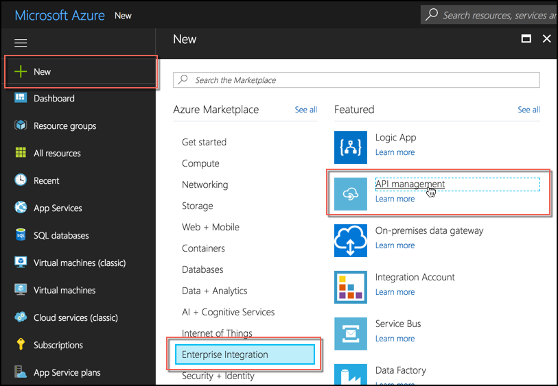

# Workshop: Let's APIfy the world with Azure API Management

Today, all big cloud players like Amazon, Google and Azure provide an API Management solution that we can use to productize our data and Services in minutes, removing the friction we have while integrating them no matter if they are public or behind a virtual private network. Moreover, they help us to control, secure and document them, allowing developers of your company (or others) to use all the available tools in a unified and controlled way.

During this workshop, we are going to implement a simple use case to demonstrate how you can use Azure API Management to generate a consistent API ecosystem for your company and/or the rest of the world.

## Concepts covered

* API definitions (with Swagger)
* Azure API Gateway configurations (Products and Policies)
* Publisher portal
* Developer portal

## Requirements

* An [Azure account](https://portal.azure.com)
* [Visual Studio](https://www.visualstudio.com/downloads/) for Windows or Mac.

## Prerequisites

Before starting, you need to create an Azure API Management service in your Azure account. To do this, follow these steps. Because this action might take a while to complete (between 15 and 30 minutes), make sure you have done this before starting the workshop.

1. Sign in to the [Azure Portal](https://portal.azure.com).
1. In the left panel, click **New**, **Enterprise Integration** and then **API Management**.

    

1. In the **API Management service** window, fill the following values leaving the rest of them with the value set. Then, click **Create** to start provisioning your service instance:

    * Name: `netconf-<YOUR-USERNAME>`
    * Organization name: `NETConf`
    * Pricing tier: `Developer`
    * Pin to dashboard: `yes` (checked)

    

    > **Note:** API Management Service instances are available in three tiers: Developer, Standard, and Premium. The Developer Tier is for development, testing, and pilot API programs where high availability is not a concern. In the Standard and Premium tiers, you can scale your reserved unit count to handle more traffic, but the cost is higher. For more information about API Management tiers, see [API Management pricing](http://azure.microsoft.com/pricing/details/api-management/).

After you click **Create** the process to provision your Service instance will start and will take some time to complete (15-30 minutes). You can see its progress in both *Azure Dashboard* and the **Notifications panel**.

Once the Service instance is created, you can start with the Exercises of this Workshop.

## Exercises

1. [Create your first API](./exercise-1)
1. [Configure your API with an Azure API Gateway](./exercise-2)
1. [Configure your Azure API Gateway](./exercise-3)